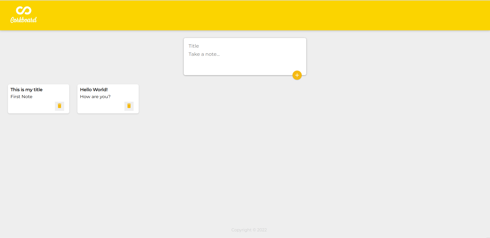

<div align="center">

  
  <h1>Corkboard</h1>
  
  <p>
    A React.js clone of google keep! 
  </p>
   
<h4>
    <a href="#">View Demo (Soon)</a>
  <span> · </span>
    <a href="https://github.com/fullsnacker/corkboard/issues">Report Bug</a>
  <span> · </span>
    <a href="https://github.com/Louis3797/awesome-readme-template/issues/">Request Feature</a>
  </h4>
</div>

<br />

<!-- Table of Contents -->
# :notebook_with_decorative_cover: Table of Contents

- [About the Project](#star2-about-the-project)
  * [Screenshots](#camera-screenshots)
  * [Tech Stack](#space_invader-tech-stack)
- [Getting Started](#toolbox-getting-started)
  * [Run Locally](#running-run-locally)
- [Roadmap](#compass-roadmap)
- [Contact](#handshake-contact)
- [Acknowledgements](#gem-acknowledgements)

  

<!-- About the Project -->
## :star2: About the Project

<div>
  <p>This is a Front-End only (For now) clone of "Google Keep" made with React.js</p>
  <p>You can create and delete notes in this board!</p>
</div>

<!-- Screenshots -->
### :camera: Screenshots

<div align="center"> 
   
</div>


<!-- TechStack -->
### :space_invader: Tech Stack

<details>
  <summary>Client</summary>
  <ul>
    <li><a href="https://reactjs.org/">React.js</a></li>
  </ul>
</details>

<details>
  <summary>Server - Coming Soon</summary>
</details>

<details>
<summary>Database - Coming Soon</summary>
</details>

<!-- Getting Started -->
## 	:toolbox: Getting Started

<!-- Run Locally -->
### :running: Run Locally

Clone the project

```bash
  git clone https://github.com/fullsnacker/corkboard.git
```

Go to the project directory

```bash
  cd corkboard
```

Install dependencies

```bash
  npm install
```

Start the server

```bash
  npm start
```

<!-- Roadmap -->
## :compass: Roadmap

* [x] Front End Functionality
* [ ] Add Server Side
* [ ] Add DataBase with MongoDB
* [ ] Deploy full version


<!-- Contributing 
## :wave: Contributing

<a href="https://github.com/Louis3797/awesome-readme-template/graphs/contributors">
  
</a>


Contributions are always welcome!

See `contributing.md` for ways to get started.


<!-- Code of Conduct 
### :scroll: Code of Conduct

Please read the [Code of Conduct](https://github.com/Louis3797/awesome-readme-template/blob/master/CODE_OF_CONDUCT.md)

<!-- FAQ 
## :grey_question: FAQ

- Question 1

  + Answer 1

- Question 2

  + Answer 2
-->

<!-- License 
## :warning: License

Distributed under the no License. See LICENSE.txt for more information.
-->

<!-- Contact -->
## :handshake: Contact

Fullsnacker - [@fullsnacker](https://twitter.com/fullsnacker) - fullsnacker@gmail.com

<!-- Acknowledgments -->
## :gem: Acknowledgements

 - [Awesome README](https://github.com/matiassingers/awesome-readme)
 - [React Documentation](https://es.reactjs.org/docs/getting-started.html)
